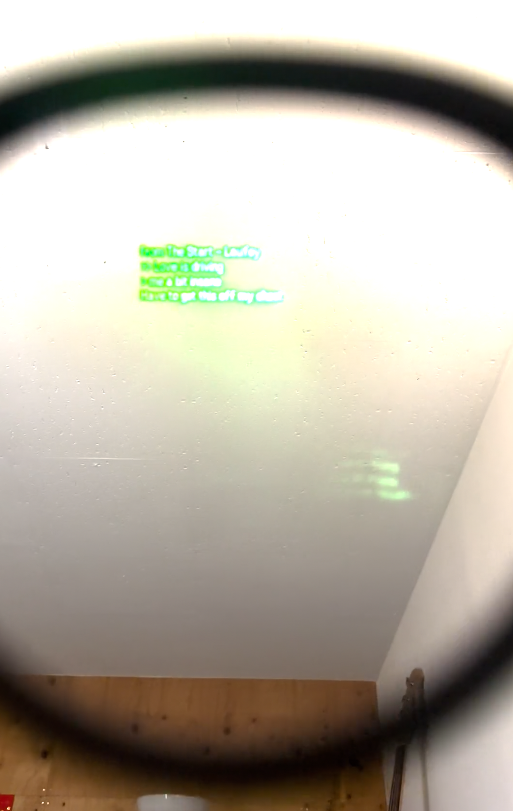

# AR Spotify Lyrics for Mentra G1

A personal MentraOS app that shows Spotify lyrics on Even Realities G1 glasses, with optional Chinese/Japanese/Korean romanization and live per-user settings.

Project docs live under [`docs/README.md`](/Users/macintoso/Documents/VSCode/mentra-g1-app/docs/README.md).

## Demo

<video src="docs/media/demo.mp4" controls width="800"></video>

Fallback: [](docs/media/demo.mp4)
Direct file link: [demo.mp4](docs/media/demo.mp4)

## What It Does

- Connects to Spotify and reads the currently playing track
- Fetches synced lyrics (LRCLIB first, NetEase fallback)
- Displays title + lyric context on G1
- Supports optional Chinese pinyin, Japanese romanization, and Korean romanization
- Exposes a `/webview` settings page in Mentra iOS app
- Persists Spotify tokens and settings locally to reduce restart friction

## Quick Start

1. Install dependencies:
```bash
bun install
```
2. Create your env file:
```bash
cp .env.example .env
```
3. Fill in required values in `.env`:
```env
PORT=3000
PACKAGE_NAME=com.yourname.yourapp
MENTRAOS_API_KEY=your_mentra_api_key
SPOTIFY_CLIENT_ID=your_spotify_client_id
SPOTIFY_CLIENT_SECRET=your_spotify_client_secret
SPOTIFY_REDIRECT_URI=https://your-ngrok-url.ngrok-free.dev/spotify/callback
```
4. Run the app:
```bash
bun run dev
```
5. Expose it with ngrok:
```bash
ngrok http 3000
```
6. In Mentra developer console, set your app public URL to the ngrok HTTPS URL and ensure `PACKAGE_NAME` exactly matches.
7. Open Spotify auth:
```text
https://<your-ngrok-url>/spotify/login
```
8. Launch your app from Mentra iOS app / G1.

## Notes on GitHub Video Embeds

This README tries inline HTML `<video>` first and keeps a poster-image fallback link below it for compatibility.

## Useful Routes

- `/spotify/login`
- `/spotify/callback`
- `/spotify/status`
- `/webview`

## Local Helper Script

Use this to restart dev quickly and open Spotify login:

```bash
/bin/zsh .local/restart-dev-and-open-login.sh
```
